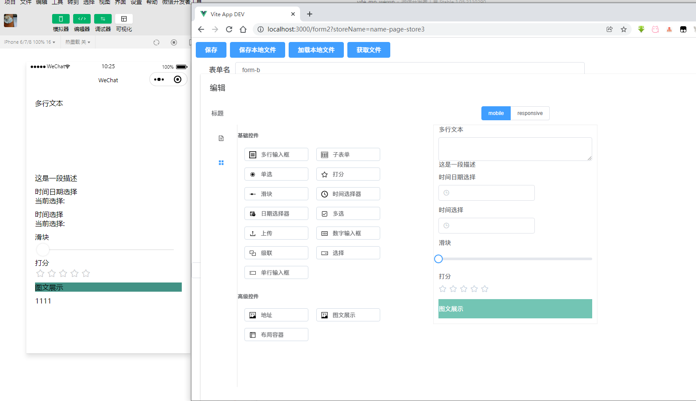

## 简介

3500 求一份工作   什么时候都可以干活

android  uniapp  都会做

java 后端也会

自己在toml基础上加强 开发了自己的配置语言 mytoml

```toml
# 定义函数
@['name', 'arg0', 'arg1', """a=`arg0`; return = `a`;"""]

a = [1,2]
# 使用外部函数
b = `CALL('customFun')`
# 执行内部函数
c = `RUN('name', b, 2)`

d = 0
each[a, """ d=`d+1`; """]

```

<a href="/crm/凌柏超-web前端-个人简历2.pdf" download="凌柏超的个人简历">下载个人简历</a>

<!-- 前端工程师只是程序员的一个专业方向, 因此我们首先应该是一个优秀的程序员.

1. 发现问题/解决问题/总结问题的能力(写写博客锻炼下自己的写作能力, 输出就是最好的学习)
2. 沟通能力/团队协作(各种软技能/辅助技能)
3. 主动做事的执行力(给你什么做什么 -> 没人给你时, 自己决定做什么, 思考怎么做, 为什么做)

然后再在前端这个专业方向上有更深入的研究

1. 跨平台前端开发 （实现小程序，web端通用，native也部分通用）
2. 提升个人的(前端)工作效率和工作质量
3. 提升用户体验, 通过技术驱动业务, 提升产品价值 -->



## 自我

1. 前端博客链接
   
   [https://segmentfault.com/u/andypinet](https://segmentfault.com/u/andypinet)
   
   [https://zhuanlan.zhihu.com/c_114049504](https://zhuanlan.zhihu.com/c_114049504)

2. 熟悉使用vue 和 layui  
   熟悉使用elementui
   熟悉使用vant 

3. 熟悉微信小程序开发流程

## 后端

### spring 

1. spring hello
2. spring mysql
3. spring mybatis
   1. 关联查询
4. spring data jpa
   1. 列表查询
5. spring jwt


