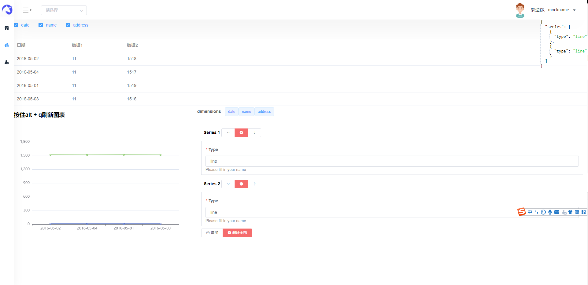

## 自我介绍

1. 前端博客
  
   [https://segmentfault.com/u/andypinet](https://segmentfault.com/u/andypinet)

   [https://gitee.com/lbc19920615](https://gitee.com/lbc19920615)

   [https://zhuanlan.zhihu.com/c_114049504](https://zhuanlan.zhihu.com/c_114049504)

2. 熟悉使用vue 和 layui  熟悉使用elementui
vant uniapp

3. 熟悉微信小程序开发流程

## fed-tool
1. h5页面快速生成
2. echarts表格生成
    

## 文章列表

1. [web单页面可视化编辑器](articles/s1.md)
2. [mongodb安装](articles/mongo.md)

## bug处理积累

1. [json](bug/json.md)