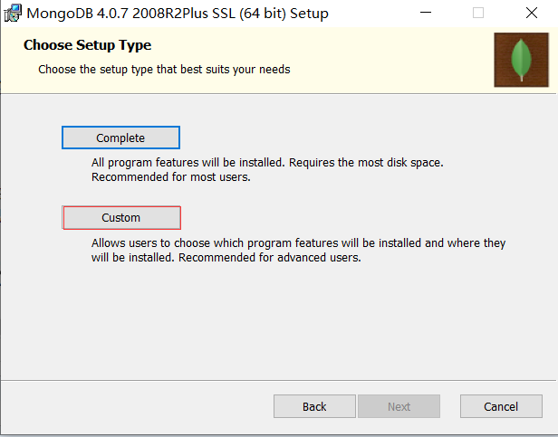
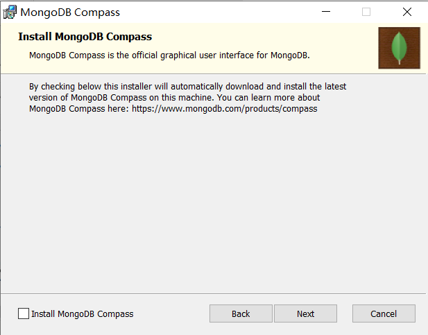
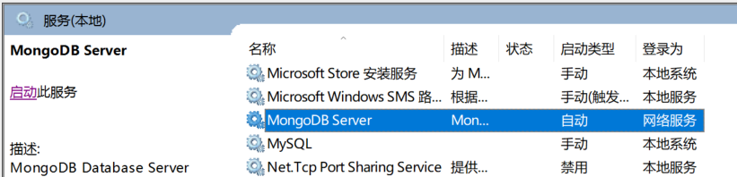

## 在windows配置mongodb服务

### 安装

1.  在https://www.mongodb.com/download-center/community下载

2.  双击打开文件进行安装，在安装过程中，可以通过点击 "Custom(自定义)" 按钮来设置你的安装目录。

    

3. 注意不要选择 "Install MongoDB Compass"

    

### 配置

1. 将MongoDB的 bin 添加到环境变量path中

    

2. 删除mongodb自动安装的mongdb server服务

    

3. 安装新的服务

    > 注意 要使用root权限打开cmd 或者 其他terminal

    在windows服务里注册一条自启动服务

    ```bash
    mongod --dbpath "YOURPATH:\MongoDB\data\db" --logpath "YOURPATH:\MongoDB\data\log\mongo.log" -install -serviceName "MongoDB"
    ```

最后使用 ```net start mongodb``` 启动服务