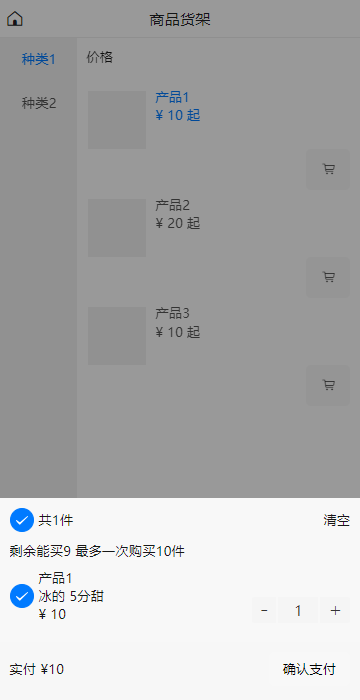

# 使用kotlin开发混合app uniapp

## 主业务使用uniapp

主业务代码可以跑在webview  小程序模式

## 技术
### 后端采用 springframework  
### 数据库使用 mysql

## 开发功能
### 任务
1. 用户登录 注册                                               
   级别 1
2. 用户接口权限     
   级别 1                                           
3. APP原生用户登录页面 (kotlin)     
   级别 1                           
4. 页面UI对接权限    
   级别 1
   
## 截图

### 首页

### 购物车

